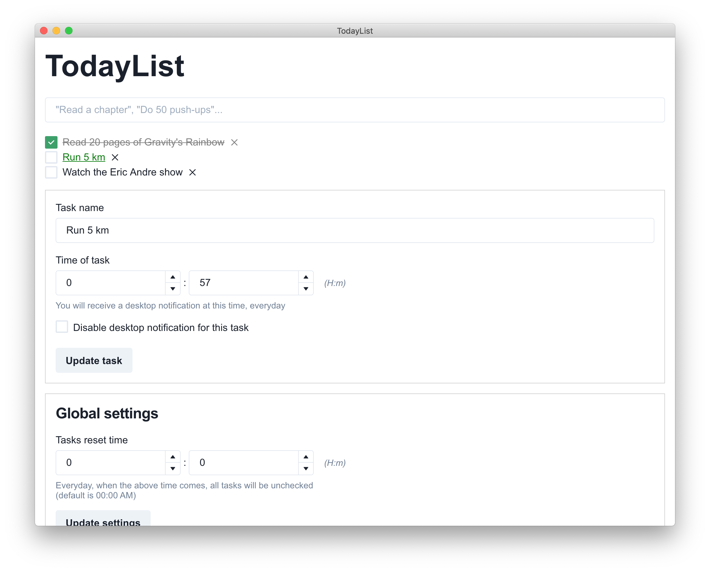

# TodayList

TodayList is a todo-app oriented towards daily habits and tasks.

It was developed with Electron, React, Redux, and Chakra UI.

### Download

Visit the [release page](https://github.com/guillaumepn/todaylist/releases) to download the app.

TODO :

- [x] Set time/date for a todo
- [x] Trigger system notification on todo's time
- [x] Define specific reset hours (all todos become unchecked)
- [ ] Set basic repetition (daily, weekly...)

Bonus :

- [ ] Add AlertDialog (from chakra) for some actions (delete todo...)
